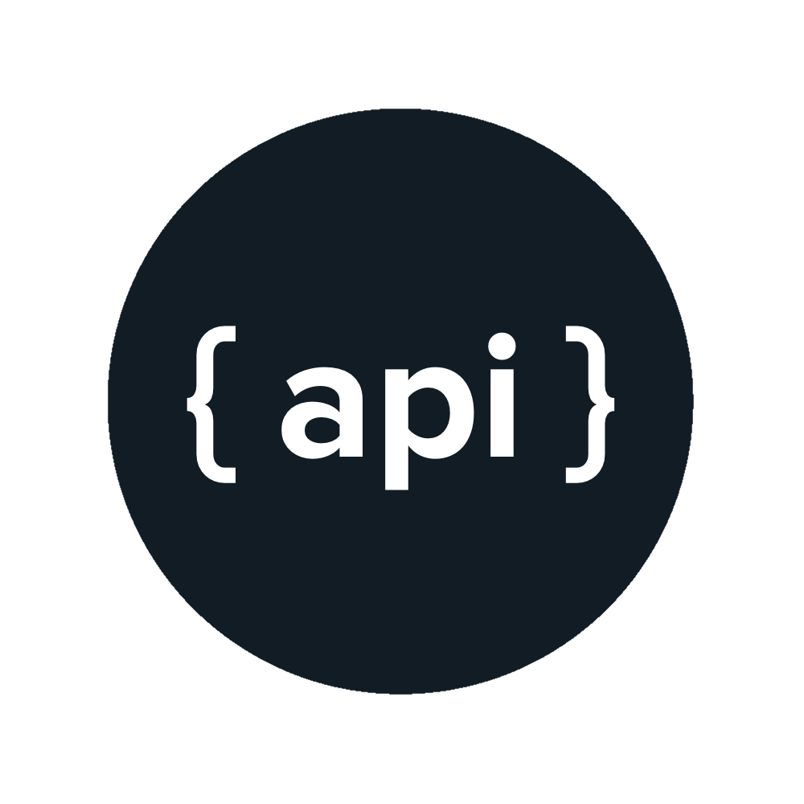
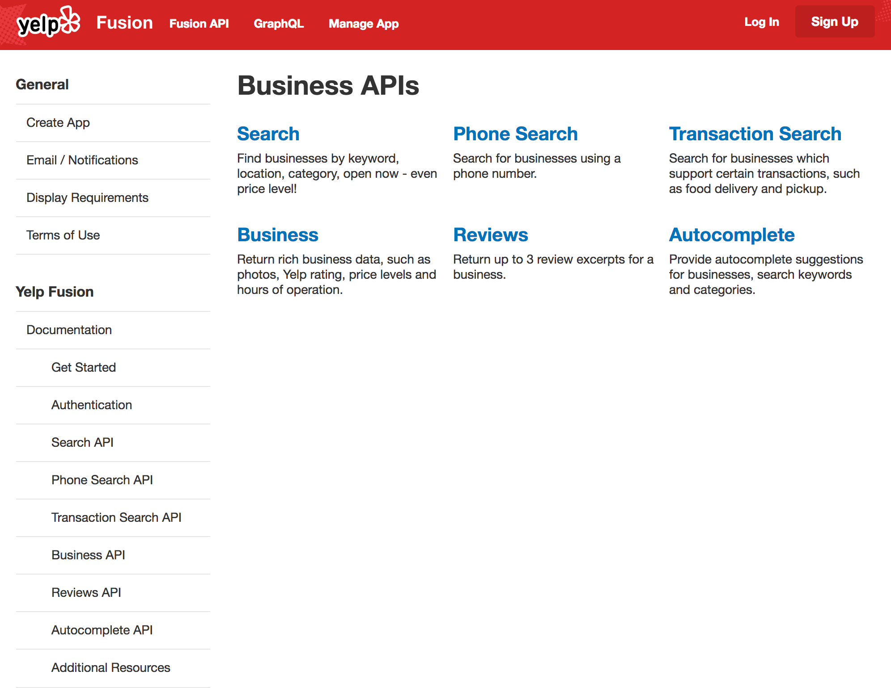
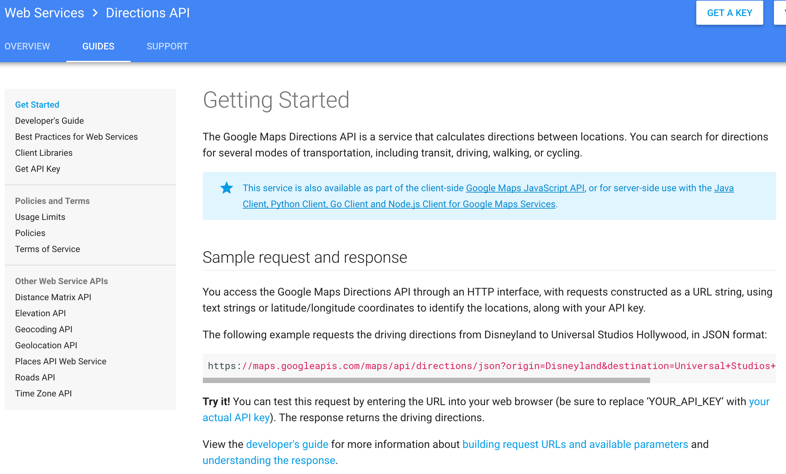
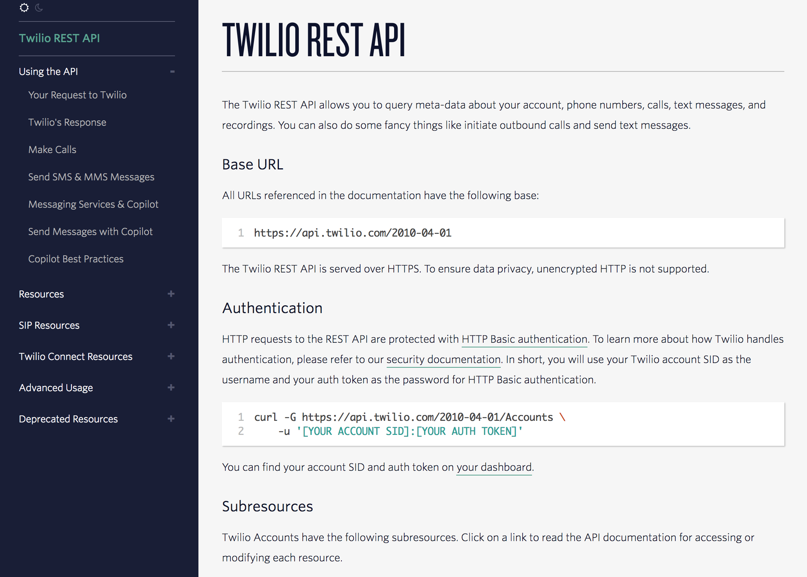
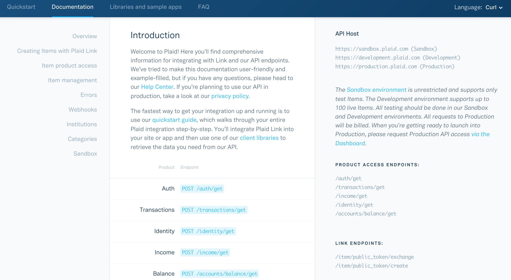
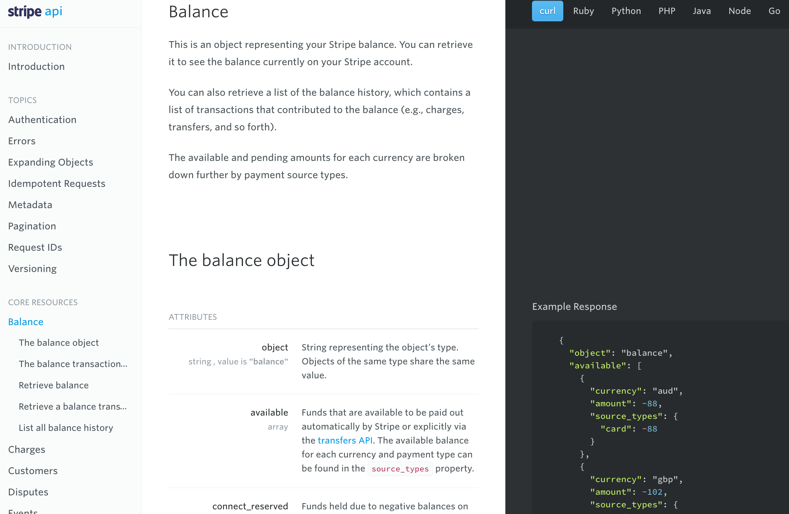
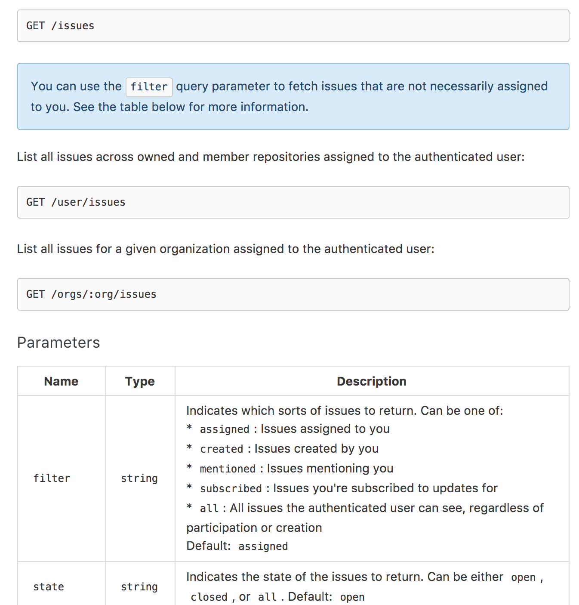
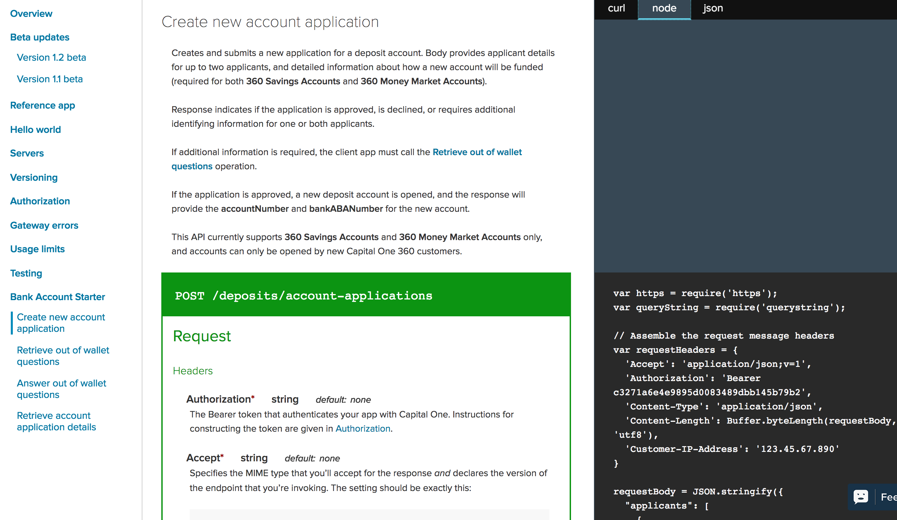
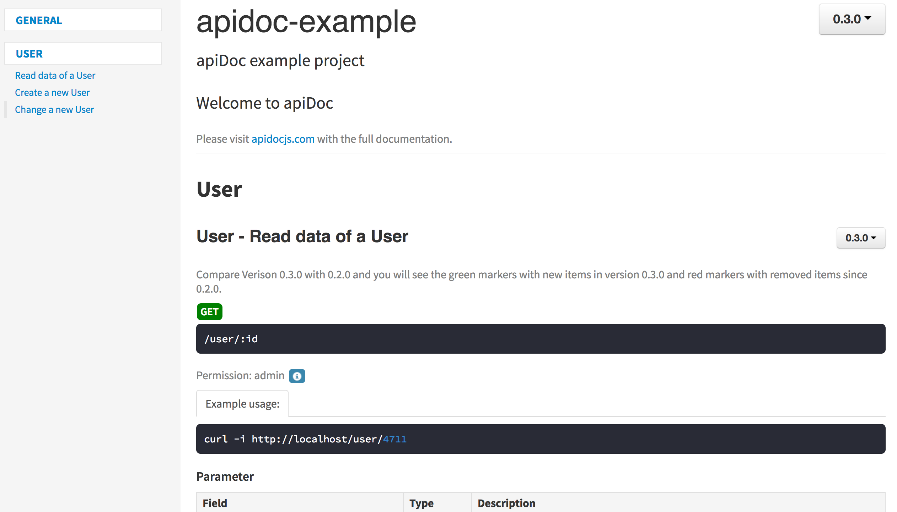

# Designing APIs 101

---

## Problem #1


I want to write a cool app that helps people get from place to place. My app needs access to map data and directions.

The data ("resources") exist, but the data do not belong to me.

--- .class #id 

## Problem #2

Luckly, I found a company that was nice enough to give me some data -- Sweet! -- in the form of a CSV files -- hmmmm...


I was provided "access" to the data, but this access method is painful. The data files are clunky, difficult to update, and at high risk of corruption. My app is gonna suck!

---

## Meet the API: Application Programming Interface



---

## "Interface" is the operative word

Enables and simplifies access to resources


---

## APIs are Everywhere: Yelp



---

## APIs are Everywhere: Google Maps



---

## APIs are Everywhere: Twilio



---

## APIs are Everywhere: Plaid



---

## APIs are Everywhere: Stripe



---

## APIs are Everywhere: GitHub



---

## APIs are Everywhere: SendGrid


---

## APIs are Everywhere: Capital One



---

## Why do companies allow others to use their data?

- New revenue opportunities
- New business partners
- Tap into innovator communities
- Core to growth strategy
- Contribute to the community
- Brand value

---

## Why don't enough financial companies do this?

- Concerns about who owns the data
    - In Europe, customers own their data
    - In the U.S., not as clear
- Potential for misuse of the data
- Privacy concerns
- Competitive fear

---

## Who _produces_ APIs?

Mr. Ballmer knows where APIs come from ...

<iframe width="560" height="315" src="https://www.youtube.com/embed/Vhh_GeBPOhs" frameborder="0"></iframe>

---

## Who _consumes_ APIs?

The same people use them, too!


---

## APIs are Products

> For `developers` whose applications require third-party resources, like data, media (images, video), computing power, and business processes, RESTful APIs are easy-to-use `interfaces` that provide reliable access to such `services`.


API = Interface + Services

---

## The Interface (the docs/access layer)

- The most important part of an API
- Defined by "the docs"
- Explains how to get the desired results
- Enables discovery; inspires creativity
- Helps answers important questions
    - "How do I do X?""
    - "What's wrong with my code?""

### The Interface Is Critical to the User Experience

- Inaccurate docs = bad customer experience
- Bad customer experience = little/no usage, little/no revenue
- Adoption starts with the interface
    - Must be understandable

---

## The Service (servers)

 - The actual service is kinda important, too ;)
 - Determines "how" to fulfill requests with wide latitude
 - Opaque to the customer
 - Behavior should be governed by the docs
 - Must consistently perform

### Service Performance is Critical to the User Experience

 - Slow responses (latency) create problems for app developers
 - Vague errors make productionalization difficult
 - Inconsistent responses make productionalization impossible

---

## Modern APIs (REST)

 - Under the hood: computers talking to computers
 - Problem
    - Need a common language for computers to understand each other
    - Hyper-text Transfer Protocol (HTTP) already exists (the "Internet")
 - Solution: 
    - Configure computers to listen and respond to requests
    - Use existing HTTP architecture to enable communication between those computers
 - How it works:
    - Open a communication session
    - (Request) Client sends entire representation of thing being communicated
    - (Response) Server responds
    - Immediately close the communication session
    - Uni-directional communication; client-initiated

---

## Modern APIs (Streaming)

 - Under the hood: computers talking to computer
 - Problem
    - Existing infrastructure has too much overhead
    - Opening and closing multiple connections can be slow and inefficient
 - Solution:
    - TCP/WebSocket technolgy enables lightweight, bi-directional communication
    - Bi-directional communication = client initiation not required
 - How it works:
    - Open a communication session
    - Keep connection open for as long as necessary
    - Communicate messages of arbitrary length back and forth at will
    - Enables publisher - subscriber models; real-time messaging

---

## REST vs. Streaming

The difference is primarily in the communication protocol

 - (HTTP/uni-directional vs. WebSockets/bi-directional)
 
not the docs, or resources accessed, _per se_

---

## Consuming RESTful APIs

Since REST relies on HTTP, REST can be described as taking an action on a resource.

### Examples

Description | Request
:------------|:--------
Retrieve all customers  | `GET /customers`
Retrieve a specific customer &nbsp; | `GET /customers/{customer_id}`
Create a new customer   | `POST /customers`
Change a specific customer &nbsp; | `PUT /customers/{customer_id}`
Delete a specific customer  | `DELETE /customers/{customer_id}`

---

## Other HTTP Operations

Less common, but still very useful HTTP operations

Description | Request
:------------|:--------
Get headers, not full response body | `HEAD /customers/{customer_id}`
Discover supported actions for a resource &nbsp; | `OPTIONS /customers/{customer_id}`
Update the _changed_ info about a resource &nbsp; | `PATCH   /customers/{customer_id}`

<br />

##### Learn More

Check out other [HTTP Methods](https://developer.mozilla.org/en-US/docs/Web/HTTP/Methods)

---

## Producing RESTful APIs - Code Later

Like any other product, programming is one of the later steps. Before writing a line a code, we must:

1. Understand the needs of our users (developers)
    - Data formats
    - Level of skill and experience
    - Familiarity with certain tools and languages
2. Understand the use cases our users are developing
    - Scalability
    - Latency
    - Resilience
    - Security
    - Persistence

---

## Producing RESTful APIS - Design First

Like all great products, great APIs are designed with users and use cases in mind 

### Start with the docs, not the service

 - Which endpoints are most important? Categorization?
 - Do we need examples? How many? In what languages?
 - What data formats should be offered (JSON, XML)?
 - Atomic vs. complex payloads?
 - What data (core, support, or reference) should be made available in each response?
 - Helpful reference vs. superfluous?
 - Read the manual vs. play around until you get it right?
 - Verbose vs. terse documentation?
 - Bandwidth-tight vs. data richness?
 - Frequency, volume expectations?

---

## Producing APIs: Language Options

Choose whichever server-side language you like:

- Ruby
- Scala
- Go
- NodeJS
- Java
- python
- PHP

It doesn't really matter

---

## Use Status Codes

### Select Status Codes

Status &nbsp; | Error
:-----:|:-------
200 | OK
201 | Created
202 | Accepted
301 | Moved Permanently
400 | Bad Request
401 | Unauthorized
403 | Forbidden
404 | Not Found
413 | Payload Too Large
429 | Too Many Requests
500 | Internal Server Error

https://en.wikipedia.org/wiki/List_of_HTTP_status_codes

---

## Use Status Codes Correctly

#### Who's fault is it?

Status Code &nbsp; | Meaning
:------------:|:---------
400 | Client made a mistake
500 | Server made a mistake

<br >

#### Authentication vs. Authorization

Status Code &nbsp; | Meaning
:------------:|:---------
401 | Your credentials are wrong
403 | Regardless of credentials, you are not allowed access

<br />

#### What kind of success are we talking about?

Status Code &nbsp; | Meaning
:------------:|:---------
200 | Not to be used with `POST` requests
201 | Not to be used outside of `POST` requests

---

## Specify the desired parameters

1. What's required? What's optional?
2. What are the default inputs, if any?
3. Integer vs floats
4. Strings vs. date stamps vs. datetime stamps
5. What are the valid range of possible values?

---

## Provide example cURL statements

### `GET` Request
```
curl -v -X GET http://www.google.com
```

### `POST` Request

```
curl -v -X POST 
    -d `{"first_name": "Rashan", "hobby": "programming"}` 
    -H "Content-Type: application/json" 
    http://www.somewhere.com
```

Most developers will first copy and paste the example to test that an API works.

---

## Other Design Considerations

 - Compress payloads
 - Consistently use standard response formats
 - Separate actions (verbs) from resources (nouns)
    - Wrong: `/GetCustomers` or `/customers/get`
    - Right: `GET /customers`

---

## Prefer JSON

### Example JSON

```
{"employees":[
    { "firstName":"John", "lastName":"Doe" },
    { "firstName":"Anna", "lastName":"Smith" },
    { "firstName":"Peter", "lastName":"Jones" }
]}

Source: https://www.w3schools.com/js/js_json_xml.asp
```

Easier to read = easier to understand.

Most clients will expect JSON

---

## Equivalent XML

```
<employees>
    <employee>
        <firstName>John</firstName> <lastName>Doe</lastName>
    </employee>
    <employee>
        <firstName>Anna</firstName> <lastName>Smith</lastName>
    </employee>
    <employee>
        <firstName>Peter</firstName> <lastName>Jones</lastName>
    </employee>
</employees>

Source: https://www.w3schools.com/js/js_json_xml.asp
```

Relatively harder to read = relatively poor user experience

Support XML only if necessary

---

## Designing APIs means...

1. Actively debating "the interface"
2. Debating technical details - they are important
3. Decomposing assumptions
4. Communicating clearly and effectively through a written and visual medium

---

## Making the Interface Human-Readable: Apiary


---

## Making the Interface Human-Readable: API Blueprint


---

## Making the Interface Human-Readable: apiDoc



---

## Making the Interface Human-Readable: Swagger


---

## Swagger


---

## YAML

### What "YAML" stands for

- Yet Another Mark-up Language
- YAML Ain't Mark-up Language

### What it is

 - A human friendly data serialization standard for all programming languages.
 - Used by Swagger to enable human readability and editability of API docs

---

## Workflow

### One Time

1. Get copy of design framework
2. Style as desired (Requires knowledge of `HTML/CSS` and potentially `Javascript`)

### For each update cycle

1. Launch Swagger (in Browser is easiet)
2. Upload or create an API spec (in YAML is easiest)
3. Edit in browser
4. Review live updates
5. Export `JSON` and `YAML` when complete (and validated)
6. Move to same directory as design framework
7. Refresh

---

## Demo

Let's create a new endpoint!

---

## Learning More

1. [Programmable Web](https://www.programmableweb.com/)
2. [TutsPlus](https://code.tutsplus.com/tutorials/a-beginners-guide-to-http-and-rest--net-16340)
3. [REST](https://en.wikipedia.org/wiki/Representational_state_transfer)
4. [WebSockets](https://en.wikipedia.org/wiki/WebSocket)

